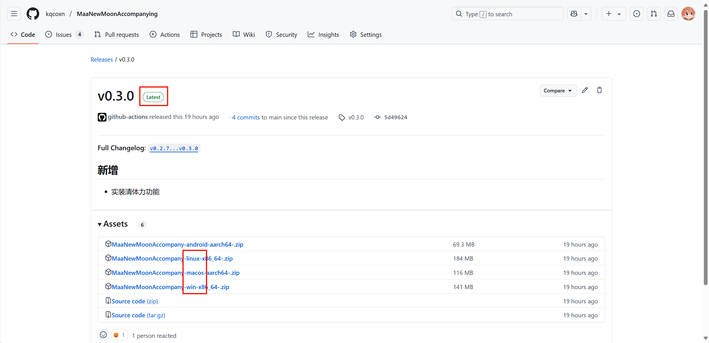
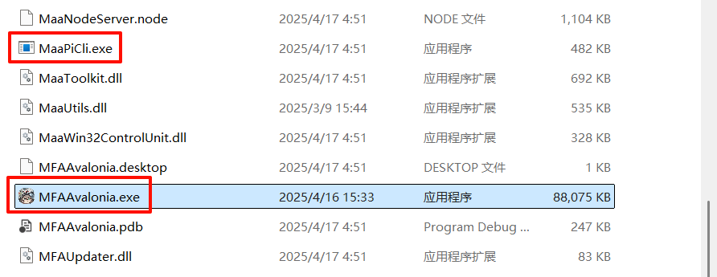
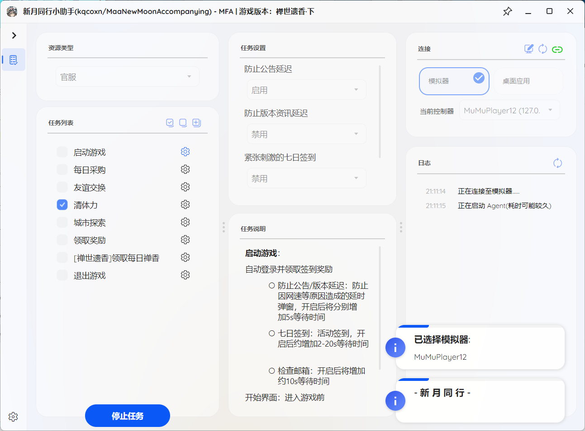

# 使用教程

如果您是第一次使用 [MAA 类软件](https://github.com/MaaXYZ/MaaFramework?tab=readme-ov-file#%E6%9C%80%E4%BD%B3%E5%AE%9E%E8%B7%B5)，请先详细阅读本教程。

如果有哪一步卡住了，可以进交流群[`993245868`](http://qm.qq.com/cgi-bin/qm/qr?_wv=1027&k=VMC132QhbMDLi5U62MlDRvtCMj9WOXRr&authKey=yJNKO4sQ%2BBFHpBCLSSEvVOAyz%2FPjknNSl70W3ugg2%2BpELnKmEiHamj1emJMWcLwQ&noverify=0&group_code=993245868)问问，但请注意礼貌~~并给予回复者充分的情绪价值~~qwq

## 准备工作

### 下载最新版安装包

根据设备系统，在 [Releases](https://github.com/kqcoxn/MaaNewMoonAccompanying/releases) 页面下载最新版安装包（带有`Latest`标签的，一般是最上面的那个）：

**注意：图片内的安卓并非手机，任何版本都需要在电脑上对模拟器或连接手机使用！**

群里一般会同步最新版本，不过每次需要手动替换根目录下所有文件。

### 解压安装包

将下载到的安装包解压到希望存放的独立文件夹中，尽量为纯英文路径。

**注意：不要在压缩软件直接打开程序！**

### 初次打开并加载环境

目录内的`MFAAvalonia.exe`为图形可视化（GUI）入口，`MaaPiCli.exe`为控制台入口，请首先尝试打开 GUI 进行尝试：

\* 可以`右键`(->`win11:显示更多选项`)->`发送到`->`桌面快捷方式`在桌面创建一个入口，方便以后使用

先打开模拟器，再双击运行`MFAAvalonia.exe`，会弹出一个窗口，如下图所示：

GUI 会依次进行连接模拟器、启动 Agent 操作，第一次打开时会自动安装 Agent 所需环境，可能等待时间较长。（若一直安不上，请参考这篇 [issue](https://github.com/kqcoxn/MaaNewMoonAccompanying/issues/4)）

待出现`任务已全部完成`字样时，即可正常使用。

### 更详细的参考：

> 以下为其他项目的使用说明，仅作参考使用

- [M9A-新手上路](https://github.com/MaaXYZ/M9A/blob/main/docs/zh_cn/manual/%E6%96%B0%E6%89%8B%E4%B8%8A%E8%B7%AF.md)

## TODO 功能使用
